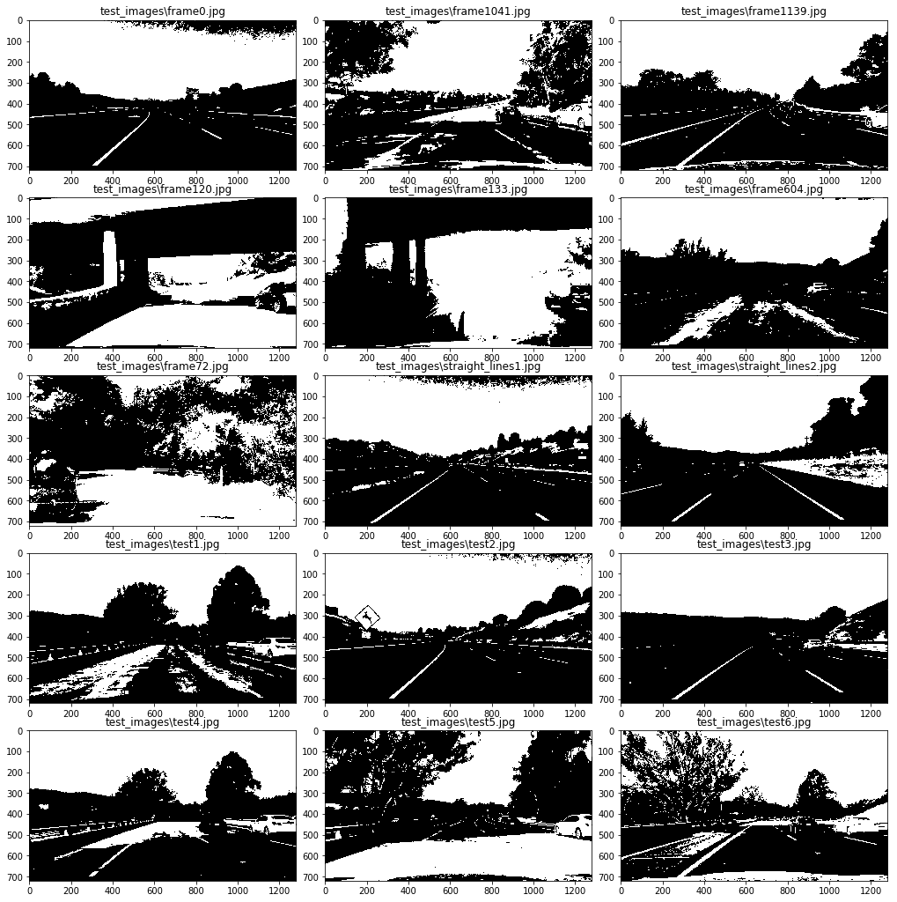
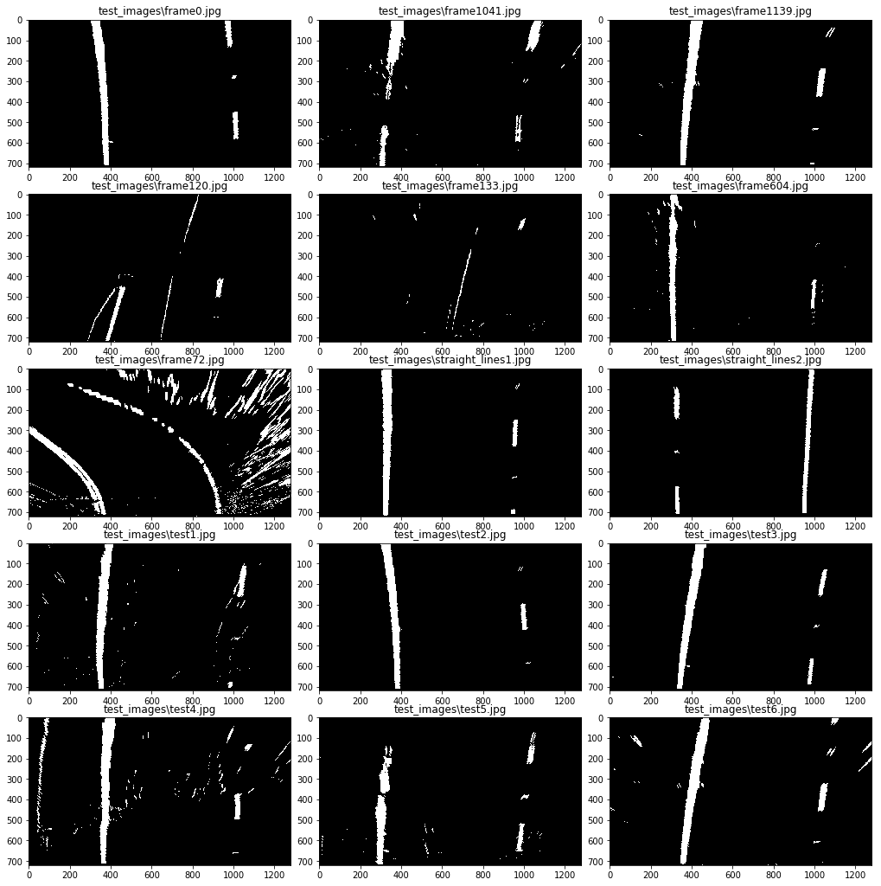
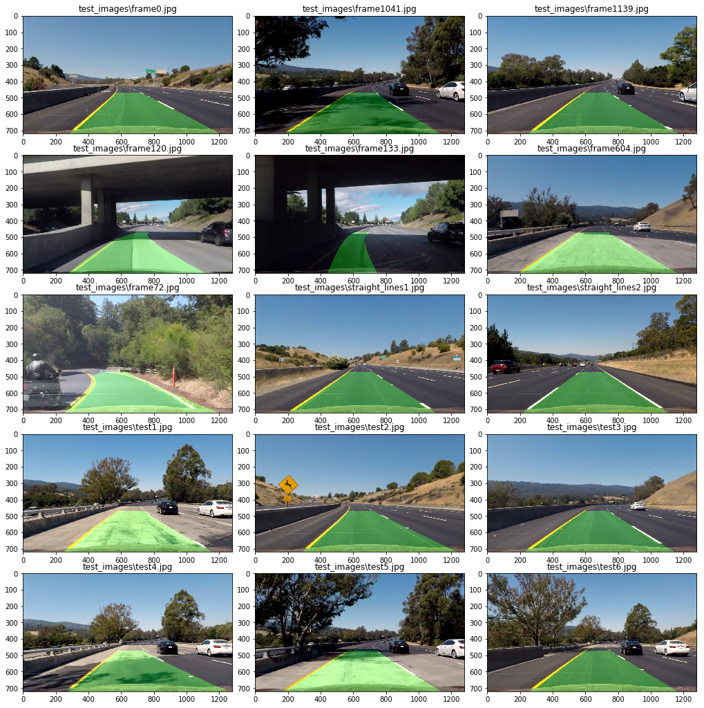

## Advanced Lane Finding Project

The goals / steps of this project are the following:

* [Compute the camera calibration matrix and distortion coefficients given a set of chessboard images.](#jump1)
* [Apply a distortion correction to raw images.](#jump2)
* [Use color transforms, gradients, etc., to create a thresholded binary image.](#jump3)
* [Apply a perspective transform to rectify binary image ("birds-eye view").](#jump4)
* [Detect lane pixels and fit to find the lane boundary.](#jump5)
* [Determine the curvature of the lane and vehicle position with respect to center.](#jump6)
* [Warp the detected lane boundaries back onto the original image.](#jump7)
* [Output visual display of the lane boundaries and numerical estimation of lane curvature and vehicle position.](#jump8)

## Step 0: Import Packages


```python
import numpy as np
import cv2
import glob
import matplotlib.pyplot as plt
import pickle
import matplotlib.image as mpimg
import os
import glob
import math
%matplotlib inline
```

## <span id="jump1">Step 1: Compute the camera calibration using chessboard images</span>

### chessboard images corner finding


```python
# prepare object points, like (0,0,0), (1,0,0), (2,0,0) ....,(6,5,0)
objp = np.zeros((6*9,3), np.float32)
objp[:,:2] = np.mgrid[0:9,0:6].T.reshape(-1,2)

# Arrays to store object points and image points from all the images.
objpoints = [] # 3d points in real world space
imgpoints = [] # 2d points in image plane.

# Make a list of calibration images
images = glob.glob('./camera_cal/calibration*.jpg')

# Step through the list and search for chessboard corners
for fname in images:
    img = cv2.imread(fname)
    gray = cv2.cvtColor(img,cv2.COLOR_BGR2GRAY)

    # Find the chessboard corners
    ret, corners = cv2.findChessboardCorners(gray, (9,6),None)

    # If found, add object points, image points
    if ret == True:
        objpoints.append(objp)
        imgpoints.append(corners)

        # Draw and display the corners
        img = cv2.drawChessboardCorners(img, (9,6), corners, ret)
        cv2.imshow('img',img)
        cv2.waitKey(200)

cv2.destroyAllWindows()
```

### Calculate distortion coefficients and save paramter


```python
img = cv2.imread('./camera_cal/test_image.jpg')
img_size = (img.shape[1], img.shape[0])
print('This image is:', type(img), 'with dimensions:', img.shape)

# Do camera calibration given object points and image points
ret, mtx, dist, rvecs, tvecs = cv2.calibrateCamera(objpoints, imgpoints, img_size,None,None)

# Save the camera calibration result for later use (we won't worry about rvecs / tvecs)
save_file = "./camera_cal/wide_dist_pickle.p"
dist_pickle = {}
dist_pickle["mtx"] = mtx
dist_pickle["dist"] = dist
pickle.dump( dist_pickle, open(save_file , "wb" ) )
```

    This image is: <class 'numpy.ndarray'> with dimensions: (720, 1280, 3)
    

### Restore distortion coefficients, and test undistortion on an image!


```python
save_file = "./camera_cal/wide_dist_pickle.p"

with open(save_file, mode='rb') as f:
    dist_pickle = pickle.load(f)

mtx = dist_pickle["mtx"] 
dist = dist_pickle["dist"] 

# Test undistortion on an image
img = cv2.imread('./camera_cal/test_image.jpg')
img_size = (img.shape[1], img.shape[0])

dst = cv2.undistort(img, mtx, dist, None, mtx)
cv2.imwrite('./camera_cal/test_undist.jpg',dst)

#dst = cv2.cvtColor(dst, cv2.COLOR_BGR2RGB)
# Visualize undistortion
f, (ax1, ax2) = plt.subplots(1, 2, figsize=(20,10))
ax1.imshow(img)
ax1.set_title('Original Image', fontsize=25)
ax2.imshow(dst)
ax2.set_title('Undistorted Image', fontsize=25)
```


    <matplotlib.text.Text at 0x1a423467be0>


## <span id="jump2">Step 2: Apply a distortion correction to raw images</span>

### List Tested Images


```python
os.listdir("test_images/")
```


    ['frame0.jpg',
     'frame1041.jpg',
     'frame1139.jpg',
     'frame120.jpg',
     'frame133.jpg',
     'frame604.jpg',
     'frame72.jpg',
     'straight_lines1.jpg',
     'straight_lines2.jpg',
     'test1.jpg',
     'test2.jpg',
     'test3.jpg',
     'test4.jpg',
     'test5.jpg',
     'test6.jpg']


### Show Images Function


```python
def show_images(images,lable = None,cols = 3,cmap = None,ticksshow = True):
    
    rows = (len(images)+cols-1)//cols 
    
    plt.figure(figsize=(14, 14))
    for i, image in enumerate(images):
        plt.subplot(rows, cols, i+1)
        
        # use gray scale color map if there is only one channel   
        showimage_shape = image.shape

        if len(showimage_shape) == 2: 
            cmap = "gray"
        elif  showimage_shape[2] == 1:
            image = image[:,:,0]
            cmap = "gray"
        
        plt.imshow(image, cmap=cmap)
        if lable != None and lable[i] != None:
            plt.title(lable[i],fontsize=12)
            
        if ticksshow != True:
            plt.xticks([])
            plt.yticks([])
            
    plt.tight_layout(pad=0, h_pad=0, w_pad=0)
    plt.show()
```

### Show raw Images


```python
read_images = [[plt.imread(path),path] for path in glob.glob('test_images/*.jpg')]
# read_images = [[plt.imread(path),path] for path in glob.glob('test_videos_output/challenge/*.jpg')]


test_images = [s[0] for s in read_images]
test_images_label = [s[1] for s in read_images]

show_images(test_images,test_images_label)
```


### Undistort Images


```python
def imageundistort(img,mtx=mtx,dist=dist):
    dst = cv2.undistort(img, mtx, dist, None, mtx)
    return dst
```


```python
undistort_images = list(map(imageundistort, test_images))

show_images(undistort_images,test_images_label)
```


## <span id="jump3">Step 3: Use color transforms, gradients, etc., to create a thresholded binary image.</span>

### color transforms:HSL HSV Lab Channel Show


```python
def channelsplit(img):
    channel_images=[]
    channel_images_label=[]
    
    #origin RGB image
    channel_images.append(img)
    channel_images_label.append('Original Image')
    
    gray = cv2.cvtColor(img, cv2.COLOR_RGB2GRAY)
    channel_images.append(gray)
    channel_images_label.append('Gray Image')  
    
    grayequalizeHist = cv2.equalizeHist(gray) 
    channel_images.append(grayequalizeHist)
    channel_images_label.append('EqualizeHist Gray Image') 
    
    #HLS image
    hls = cv2.cvtColor(img, cv2.COLOR_RGB2HLS)
    h = hls[:,:,0]
    l = hls[:,:,1]
    s = hls[:,:,2]
    channel_images.append(h)
    channel_images_label.append('HLS: H Channel Image') 
    channel_images.append(l)
    channel_images_label.append('HLS: L Channel Image') 
    channel_images.append(s)
    channel_images_label.append('HLS: S Channel Image') 
    
    #HSV image
    hsv = cv2.cvtColor(img, cv2.COLOR_RGB2HSV)
    h = hsv[:,:,0]
    s = hsv[:,:,1]
    v = hsv[:,:,2]
    channel_images.append(h)
    channel_images_label.append('HSV: H Channel Image') 
    channel_images.append(s)
    channel_images_label.append('HSV: S Channel Image') 
    channel_images.append(v)
    channel_images_label.append('HSV: V Channel Image') 
    
    #Lab image
    lab = cv2.cvtColor(img, cv2.COLOR_RGB2Lab)
    l = lab[:,:,0]
    a = lab[:,:,1]
    b = lab[:,:,2]
    channel_images.append(l)
    channel_images_label.append('Lab: L Channel Image') 
    channel_images.append(a)
    channel_images_label.append('Lab: a Channel Image') 
    channel_images.append(b)
    channel_images_label.append('Lab: b Channel Image') 
    
    return channel_images,channel_images_label
```


```python
images,label = channelsplit(undistort_images[0])

show_images(images,label)
```


### Color threshold


```python
def hsv_thresh(img, v_thresh=(145, 255)):

    hsv = cv2.cvtColor(img, cv2.COLOR_RGB2HSV)
    v_channel = hsv[:,:,2]
    v_channel = cv2.equalizeHist(v_channel) 
    
    binary_output = np.zeros_like(v_channel)
    binary_output[(v_channel >= v_thresh[0]) & (v_channel <= v_thresh[1])] = 1
    
    return binary_output
```

### Road Area Selected by HSV color space


```python
color_binary = list(map(hsv_thresh, undistort_images))

show_images(color_binary,test_images_label)
```





```python
def hls_thresh(img, s_thresh=(210, 255)):

    hsl = cv2.cvtColor(img, cv2.COLOR_RGB2HLS)
    s_channel = hsl[:,:,1]
    
    binary_output = np.zeros_like(s_channel)
    binary_output[(s_channel >= s_thresh[0]) & (s_channel <= s_thresh[1])] = 1
    
    return binary_output
```

### White Lane filtered by HLS color space


```python
color_binary = list(map(hls_thresh, undistort_images))

show_images(color_binary,test_images_label)
```


```python
def lab_thresh(img, b_thresh=(150, 255)):    
    Lab = cv2.cvtColor(img, cv2.COLOR_RGB2Lab)
    b_channel = Lab[:,:,2]
    
    binary_output = np.zeros_like(b_channel)
    binary_output[(b_channel >= b_thresh[0]) & (b_channel <= b_thresh[1])] = 1
    
    return binary_output
```

### Yellow Lane filtered by Lab color space


```python
color_binary = list(map(lab_thresh, undistort_images))

show_images(color_binary,test_images_label)
```


### gradients: sobel


```python
def sobel_thresh(img, orient='x',sobel_thresh=(20, 255)):
    # Convert to grayscale
    gray = cv2.cvtColor(img, cv2.COLOR_RGB2GRAY)
    gray = cv2.equalizeHist(gray) 
    
    # Apply x or y gradient with the OpenCV Sobel() function
    # and take the absolute value
    if orient == 'x':
        abs_sobel = np.absolute(cv2.Sobel(gray, cv2.CV_64F, 1, 0,ksize=5))
    if orient == 'y':
        abs_sobel = np.absolute(cv2.Sobel(gray, cv2.CV_64F, 0, 1,ksize=5))
        
    #Absolute x derivative to accentuate lines away from horizontal
    scaled_sobel = np.uint8(255*abs_sobel/np.max(abs_sobel))
    
    # Create a copy and apply the threshold
    binary_output = np.zeros_like(scaled_sobel)
    binary_output[(scaled_sobel >= sobel_thresh[0]) & (scaled_sobel <= sobel_thresh[1])] = 1

    # Return the result
    return binary_output

def mag_thresh(img, sobel_kernel=3, mag_thresh=(50, 255)):

    # Convert to grayscale
    gray = cv2.cvtColor(img, cv2.COLOR_RGB2GRAY)
    # Take both Sobel x and y gradients
    sobelx = cv2.Sobel(gray, cv2.CV_64F, 1, 0, ksize=sobel_kernel)
    sobely = cv2.Sobel(gray, cv2.CV_64F, 0, 1, ksize=sobel_kernel)
    # Calculate the gradient magnitude
    gradmag = np.sqrt(sobelx**2 + sobely**2)
    # Rescale to 8 bit
    scale_factor = np.max(gradmag)/255
    gradmag = (gradmag/scale_factor).astype(np.uint8)
    
    binary_output = np.zeros_like(gradmag)
    binary_output[(gradmag >= mag_thresh[0]) & (gradmag <= mag_thresh[1])] = 1

    return binary_output

def dir_threshold(img, sobel_kernel=15, thresh=(0.7, np.pi/2)):
    # Convert to grayscale
    gray = cv2.cvtColor(img, cv2.COLOR_RGB2GRAY)
    # Calculate the x and y gradients
    sobelx = cv2.Sobel(gray, cv2.CV_64F, 1, 0, ksize=sobel_kernel)
    sobely = cv2.Sobel(gray, cv2.CV_64F, 0, 1, ksize=sobel_kernel)
    # Take the absolute value of the gradient direction,
    # apply a threshold, and create a binary image result
    absgraddir = np.arctan2(np.absolute(sobely), np.absolute(sobelx))
    binary_output =  np.zeros_like(absgraddir)
    binary_output[(absgraddir >= thresh[0]) & (absgraddir <= thresh[1])] = 1

    return binary_output

def pipeline_test(img):
    mag_thresh_bin = mag_thresh(img)
    dir_thresh_bin = dir_threshold(img)
    
    color_binary = np.dstack(( np.zeros_like(mag_thresh_bin), mag_thresh_bin, dir_thresh_bin)) 

    combined_binary = np.zeros_like(mag_thresh_bin)
    combined_binary[ (mag_thresh_bin == 1) & (dir_thresh_bin == 1)] = 1
    
    return combined_binary
```


```python
gradient_binary = list(map(sobel_thresh, undistort_images))

show_images(gradient_binary,test_images_label)
```


###  Combined thresholded binary


```python
def pipeline(img):
    sobel_thresh_bin = sobel_thresh(img)
    hsv_thresh_bin = hsv_thresh(img)
    hsl_thresh_bin = hls_thresh(img)
    lab_thresh_bin = lab_thresh(img)
    
    color_binary = np.dstack(( np.zeros_like(sobel_thresh_bin), sobel_thresh_bin, hsv_thresh_bin)) *255

    combined_binary = np.zeros_like(sobel_thresh_bin)
    
    combined_binary[ ((sobel_thresh_bin == 1) & (hsv_thresh_bin == 1)) |(hsl_thresh_bin == 1)| (lab_thresh_bin == 1)] = 1
    
    return combined_binary
```


```python
filted_binary = list(map(pipeline, undistort_images))

show_images(filted_binary,test_images_label)
```


## <span id="jump4">Step 4: Apply a perspective transform to rectify binary image ("birds-eye view").</span>

### Perspective Transformed View Point


```python
def perspective_transform_matrix(img,show_debug = False):
    img_size = (img.shape[1],img.shape[0])
    src = np.float32(\
    [[(img_size[0] / 2) - 75, img_size[1] / 2 + 110],\
     [((img_size[0] / 6) - 10), img_size[1]],\
     [(img_size[0] * 5 / 6) + 60, img_size[1]],\
     [(img_size[0] / 2 + 75), img_size[1] / 2 + 110]]) 

    dst = np.float32(\
    [[(img_size[0] / 4), 0],\
     [(img_size[0] / 4), img_size[1]],\
     [(img_size[0] * 3 / 4), img_size[1]],\
     [(img_size[0] * 3 / 4), 0]])
    
    M = cv2.getPerspectiveTransform(src, dst)
    Minv = cv2.getPerspectiveTransform(dst, src)
    
    if show_debug == True:
        print("source view point")
        print(src)
        print("Transformed view point")
        print(dst)

        plt.figure(figsize=(15, 15))
        plt.subplot(1, 2, 1)
        plt.imshow(img) 
        plt.plot(src[:,0], src[:,1], 'rx')
        plt.title('Original Image')

        plt.subplot(1, 2, 2)
        warped = cv2.warpPerspective(img, M, img_size, flags=cv2.INTER_LINEAR)
        plt.imshow(warped) 
        plt.plot(dst[:,0], dst[:,1], 'rx')
        plt.title('Perspective Transformed Image')
    
    return M,Minv
```


```python
straightimage = mpimg.imread('test_images/straight_lines1.jpg')

M,Minv = perspective_transform_matrix(straightimage,show_debug=True)
```

    source view point
    [[  565.           470.        ]
     [  203.33332825   720.        ]
     [ 1126.66662598   720.        ]
     [  715.           470.        ]]
    Transformed view point
    [[ 320.    0.]
     [ 320.  720.]
     [ 960.  720.]
     [ 960.    0.]]
    


```python
def warp(img):
    img_size = (img.shape[1],img.shape[0])
    
    M,Minv = perspective_transform_matrix(img)
    warped = cv2.warpPerspective(img, M, img_size, flags=cv2.INTER_LINEAR)
    
    return warped
```

### Lane marked Perspective Transform


```python
warp_images = list(map(warp, filted_binary))

show_images(warp_images,test_images_label)
```





## <span id="jump5">Step 5: Detect lane pixels and fit to find the lane boundary.</span>

### Line Finding Method:Peaks in a Histogram


```python
def show_histogram(images,cols = 3):
    rows = (len(images)+cols-1)//cols 
    
    plt.figure(figsize=(20, 20))
    for i, image in enumerate(images):
        plt.subplot(rows, cols, i+1)
        
        histogram = np.sum(image[image.shape[0]//2:,:], axis=0)
        plt.plot(histogram)
    
    plt.show()
```


```python
show_histogram(warp_images)
```


```python
def recognize_lane(binary_warped,nwindows = 9,margin = 100,minpix = 50,bias=0.2):
    """
    margin: Set the width of the windows +/- margin
    minpix: Set minimum number of pixels found to recenter window
    bias: left start nad right start offest from middpoint
    """
    # Assuming you have created a warped binary image called "binary_warped"
    # Take a histogram of the bottom half of the image
    histogram = np.sum(binary_warped[binary_warped.shape[0]//2:,:], axis=0)
    
    # Create an output image to draw on and  visualize the result
    out_img = np.dstack((binary_warped, binary_warped, binary_warped))*255
    # Find the peak of the left and right halves of the histogram
    # These will be the starting point for the left and right lines
    midpoint = np.int(histogram.shape[0]/2)
    
    leftstart = int((1-bias)*midpoint)
    rightstart = int((1+bias)*midpoint)
    
    leftx_base = np.argmax(histogram[:leftstart])
    rightx_base = np.argmax(histogram[rightstart:]) + rightstart

    # Set height of windows
    window_height = np.int(binary_warped.shape[0]/nwindows)
    # Identify the x and y positions of all nonzero pixels in the image
    nonzero = binary_warped.nonzero()
    nonzeroy = np.array(nonzero[0])
    nonzerox = np.array(nonzero[1])

    # Current positions to be updated for each window
    leftx_current = leftx_base
    rightx_current = rightx_base

    left_lane_inds = []
    right_lane_inds = []

    # Step through the windows one by one
    for window in range(nwindows):
        # Identify window boundaries in x and y (and right and left)
        win_y_low = binary_warped.shape[0] - (window+1)*window_height
        win_y_high = binary_warped.shape[0] - window*window_height
        win_xleft_low = leftx_current - margin
        win_xleft_high = leftx_current + margin
        win_xright_low = rightx_current - margin
        win_xright_high = rightx_current + margin
        # Draw the windows on the visualization image
        cv2.rectangle(out_img,(win_xleft_low,win_y_low),(win_xleft_high,win_y_high),(0,255,0), 4) 
        cv2.rectangle(out_img,(win_xright_low,win_y_low),(win_xright_high,win_y_high),(0,255,0), 4) 
        # Identify the nonzero pixels in x and y within the window
        good_left_inds = ((nonzeroy >= win_y_low) & (nonzeroy < win_y_high) & 
        (nonzerox >= win_xleft_low) &  (nonzerox < win_xleft_high)).nonzero()[0]
        good_right_inds = ((nonzeroy >= win_y_low) & (nonzeroy < win_y_high) & 
        (nonzerox >= win_xright_low) &  (nonzerox < win_xright_high)).nonzero()[0]
        # Append these indices to the lists
        left_lane_inds.append(good_left_inds)
        right_lane_inds.append(good_right_inds)

        # If you found > minpix pixels, recenter next window on their mean position
        if len(good_left_inds) > minpix:
            leftx_current = np.int(np.mean(nonzerox[good_left_inds]))
        if len(good_right_inds) > minpix:        
            rightx_current = np.int(np.mean(nonzerox[good_right_inds]))

    # Concatenate the arrays of indices
    left_lane_inds = np.concatenate(left_lane_inds)
    right_lane_inds = np.concatenate(right_lane_inds)

    # Extract left and right line pixel positions
    leftx = nonzerox[left_lane_inds]
    lefty = nonzeroy[left_lane_inds] 
    rightx = nonzerox[right_lane_inds]
    righty = nonzeroy[right_lane_inds] 

    out_img[nonzeroy[left_lane_inds], nonzerox[left_lane_inds]] = [255, 0, 0]
    out_img[nonzeroy[right_lane_inds], nonzerox[right_lane_inds]] = [0, 0, 255] 
    
    left_fit = None
    right_fit = None
    
    ploty = np.linspace(0, binary_warped.shape[0]-1, binary_warped.shape[0] )
    
     # Fit a second order polynomial to each
    if len(leftx) != 0:
        left_fit = np.polyfit(lefty, leftx, 2)
        p_left = np.poly1d(left_fit)
        left_fitx = p_left(ploty)
        left_line_pts = np.array([np.transpose(np.vstack([left_fitx, ploty]))])
        cv2.polylines(out_img, np.int_(left_line_pts), isClosed=False, color=(255,255,0), thickness=5)
        
    if len(rightx) != 0:
        right_fit = np.polyfit(righty, rightx, 2)
        p_right = np.poly1d(right_fit)
        right_fitx = p_right(ploty)   
        right_line_pts = np.array([np.transpose(np.vstack([right_fitx, ploty]))])
        cv2.polylines(out_img, np.int_(right_line_pts), isClosed=False, color=(255,255,0), thickness=5)
    
    return out_img,left_fit,right_fit
```


```python
recogin_images = list(map(recognize_lane, warp_images))

fittedimge = [s[0] for s in recogin_images]
left_fit = [s[1] for s in recogin_images]
right_fit = [s[2] for s in recogin_images]

show_images(fittedimge,test_images_label)
```


```python
def recognize_fitted_lane(binary_warped,left_fit,right_fit,margin = 100,minpix = 50):
    # Assume you now have a new warped binary image 
    # from the next frame of video (also called "binary_warped")
    # It's now much easier to find line pixels!
    nonzero = binary_warped.nonzero()
    nonzeroy = np.array(nonzero[0])
    nonzerox = np.array(nonzero[1])

    left_lane_inds = ((nonzerox > (left_fit[0]*(nonzeroy**2) + left_fit[1]*nonzeroy + 
    left_fit[2] - margin)) & (nonzerox < (left_fit[0]*(nonzeroy**2) + 
    left_fit[1]*nonzeroy + left_fit[2] + margin))) 

    right_lane_inds = ((nonzerox > (right_fit[0]*(nonzeroy**2) + right_fit[1]*nonzeroy + 
    right_fit[2] - margin)) & (nonzerox < (right_fit[0]*(nonzeroy**2) + 
    right_fit[1]*nonzeroy + right_fit[2] + margin)))  

    # Again, extract left and right line pixel positions
    leftx = nonzerox[left_lane_inds]
    lefty = nonzeroy[left_lane_inds] 
    rightx = nonzerox[right_lane_inds]
    righty = nonzeroy[right_lane_inds]
    
    # Create an image to draw on and an image to show the selection window
    out_img = np.dstack((binary_warped, binary_warped, binary_warped))*255
    window_img = np.zeros_like(out_img)
    # Color in left and right line pixels
    out_img[nonzeroy[left_lane_inds], nonzerox[left_lane_inds]] = [255, 0, 0]
    out_img[nonzeroy[right_lane_inds], nonzerox[right_lane_inds]] = [0, 0, 255]
    
    left_new_fit = None
    right_new_fit = None
    
    ploty = np.linspace(0, binary_warped.shape[0]-1, binary_warped.shape[0] )
    # Fit a second order polynomial to each
    p_left = np.poly1d(left_fit)
    left_fitx = p_left(ploty)
        
    left_line_window1 = np.array([np.transpose(np.vstack([left_fitx-margin, ploty]))])
    left_line_window2 = np.array([np.flipud(np.transpose(np.vstack([left_fitx+margin, 
                                  ploty])))])
    left_line_pts = np.hstack((left_line_window1, left_line_window2))
    cv2.fillPoly(window_img, np.int_([left_line_pts]), (0,255, 0))
    
    p_right = np.poly1d(right_fit)
    right_fitx = p_right(ploty) 
        
     # Generate a polygon to illustrate the search window area
    right_line_window1 = np.array([np.transpose(np.vstack([right_fitx-margin, ploty]))])
    right_line_window2 = np.array([np.flipud(np.transpose(np.vstack([right_fitx+margin, 
                                  ploty])))])
    right_line_pts = np.hstack((right_line_window1, right_line_window2))

    # Draw the lane onto the warped blank image
    
    cv2.fillPoly(window_img, np.int_([right_line_pts]), (0,255, 0))
        
    
    if len(leftx) != 0:
        left_new_fit = np.polyfit(lefty, leftx, 2)
        p_left = np.poly1d(left_new_fit)
        left_fitx = p_left(ploty)
        # Generate a polygon to illustrate the search window area
        # And recast the x and y points into usable format for cv2.fillPoly()

        left_line_pts = np.array([np.transpose(np.vstack([left_fitx, ploty]))])
        cv2.polylines(out_img, np.int_(left_line_pts), isClosed=False, color=(255,255,0), thickness=5)
            
    if len(rightx) != 0:
        right_new_fit = np.polyfit(righty, rightx, 2)
        p_right = np.poly1d(right_new_fit)
        right_fitx = p_right(ploty)  
        
      
        right_line_pts = np.array([np.transpose(np.vstack([right_fitx, ploty]))])
        cv2.polylines(out_img, np.int_(right_line_pts), isClosed=False, color=(255,255,0), thickness=5)
    
    result = cv2.addWeighted(out_img, 1, window_img, 0.3, 0)
    
    return result,left_new_fit,right_new_fit
```


```python
recogin_images = list(map(recognize_fitted_lane, warp_images,left_fit,right_fit))

fittedimge = [s[0] for s in recogin_images]
left_fit = [s[1] for s in recogin_images]
right_fit = [s[2] for s in recogin_images]

show_images(fittedimge,test_images_label)
```


## <span id="jump6">Setp 6: Determine the curvature of the lane and vehicle position with respect to center.</span>

### Measure Lane Curvature


```python
# Define conversions in x and y from pixels space to meters
ym_per_pix = 30/720 # meters per pixel in y dimension
xm_per_pix = 3.7/700 # meters per pixel in x dimension
```


```python
def measuring_curvature(binary_warped,line_fit):

    ploty = np.linspace(0, binary_warped.shape[0]-1, binary_warped.shape[0] )
    line_fitx = line_fit[0]*ploty**2 + line_fit[1]*ploty + line_fit[2]
    
    y_eval = np.max(ploty)
    # Fit new polynomials to x,y in world space
    line_fit_cr = np.polyfit(ploty*ym_per_pix, line_fitx*xm_per_pix, 2)
    
    # Calculate the new radii of curvature
    cal_curverad = ((1 + (2*line_fit_cr[0]*y_eval*ym_per_pix + line_fit_cr[1])**2)**1.5) / np.absolute(2*line_fit_cr[0])
    
    return cal_curverad
```

### Measure vehicle position with respect to center


```python
def center_offest(binary_warped,line_fit):
    
    y_eval = binary_warped.shape[0]-1
    
    p_line = np.poly1d(line_fit)
    line_fitx = p_line(y_eval)
    
    center_offset_meter = (line_fitx-binary_warped.shape[1]/2)*xm_per_pix
    
    return center_offset_meter
```

## <span id="jump7">Setp 7: Warp the detected lane boundaries back onto the original image.</span>


```python
def unwarp(img,left_fit,right_fit):
    img_size = (img.shape[1],img.shape[0])
    
    M,Minv = perspective_transform_matrix(img)
    
    # Create an image to draw the lines on
#     warp_zero = np.zeros_like(warp_images[0]).astype(np.uint8)
#     color_warp = np.dstack((warp_zero, warp_zero, warp_zero))
    
    if left_fit != None and right_fit != None:    
        color_warp = np.zeros_like(img).astype(np.uint8)

        ploty = np.linspace(0, img.shape[0]-1, img.shape[0] )
        left_fitx = left_fit[0]*ploty**2 + left_fit[1]*ploty + left_fit[2]
        right_fitx = right_fit[0]*ploty**2 + right_fit[1]*ploty + right_fit[2]

        # Recast the x and y points into usable format for cv2.fillPoly()
        pts_left = np.array([np.transpose(np.vstack([left_fitx, ploty]))])
        pts_right = np.array([np.flipud(np.transpose(np.vstack([right_fitx, ploty])))])
        pts = np.hstack((pts_left, pts_right))

        # Draw the lane onto the warped blank image
        cv2.fillPoly(color_warp, np.int_([pts]), (0,255, 0))

        # Warp the blank back to original image space using inverse perspective matrix (Minv)
        newwarp = cv2.warpPerspective(color_warp, Minv, (img.shape[1], img.shape[0])) 
        # Combine the result with the original image
        result = cv2.addWeighted(img, 1, newwarp, 0.3, 0)
    else:
        result = img
    
    return result
```


```python
unwarp_images = list(map(unwarp, undistort_images,left_fit,right_fit))

show_images(unwarp_images,test_images_label)
```

    d:\ProgramData\Anaconda3\envs\carnd-term1\lib\site-packages\ipykernel_launcher.py:10: FutureWarning: comparison to `None` will result in an elementwise object comparison in the future.
      # Remove the CWD from sys.path while we load stuff.
    





## <span id="jump8">Setp 8: Output visual display of the lane boundaries and numerical estimation of lane curvature and vehicle position.</span>


```python
def draw_estimation(img,left_fit,right_fit):
    
    if left_fit != None and right_fit != None:
        left_cur = measuring_curvature(img,left_fit)
        right_cur = measuring_curvature(img,right_fit)

        left_center_offest_meter = center_offest(img,left_fit)
        right_center_offest_meter = center_offest(img,right_fit)
        center_offest_meter = (left_center_offest_meter + right_center_offest_meter)/2.0

        cv2.putText(img,'left curvature:{:.2f}m'.format(left_cur),(10,60),cv2.FONT_HERSHEY_COMPLEX,2,(255,255,255),3)
        cv2.putText(img,'right curvature:{:.2f}m'.format(right_cur),(10,130),cv2.FONT_HERSHEY_COMPLEX,2,(255,255,255),3)
        cv2.putText(img,'center offest:{:.2f}m'.format(center_offest_meter),(10,200),cv2.FONT_HERSHEY_COMPLEX,2,(255,255,255),3)
    
    return img
```


```python
res_images= list(map(draw_estimation, unwarp_images,left_fit,right_fit))

show_images(res_images,test_images_label)
```

    d:\ProgramData\Anaconda3\envs\carnd-term1\lib\site-packages\ipykernel_launcher.py:3: FutureWarning: comparison to `None` will result in an elementwise object comparison in the future.
      This is separate from the ipykernel package so we can avoid doing imports until
    


## Image Process with Debug

### Define Line Class


```python
from collections import deque

# Define a class to receive the characteristics of each line detection
class Line():
    def __init__(self,maxlen=10):
        # was the line detected in the last iteration?
        self.detected = False  
        
        # x values of the last n fits of the line
        self.recent_xfitted = deque(maxlen = maxlen) 
        #average x values of the fitted line over the last n iterations
        self.bestx = None     
        
        #polynomial coefficients averaged over the last n iterations
        self.best_fit = None  
        #polynomial coefficients for the most recent fit
        self.current_fit = [np.array([False])]  
        
        #radius of curvature of the line in some units
        self.radius_of_curvature = None 
        #distance in meters of vehicle center from the line
        self.line_base_pos = None 
        #difference in fit coefficients between last and new fits
        self.diffs = np.array([0,0,0], dtype='float') 
        
#         #x values for detected line pixels
#         self.allx = None  
#         #y values for detected line pixels
#         self.ally = None

    def update_detected(self,img,detected=True):
        self.detected = detected  
        #if lane lines do not dectect correctly,remove from deque
        if self.detected == False and len(self.recent_xfitted) > 0:
            self.recent_xfitted.pop()
            
        self.update_bestx(img)
        self.update_best_fit(img)
            
    def update_recent_xfitted(self,img):
        yvals = np.linspace(0,img.shape[0]-1,img.shape[0])
        current_xval = self.current_fit[0]*yvals**2 + self.current_fit[1]*yvals + self.current_fit[2]
        self.recent_xfitted.append(current_xval)

    def update_bestx(self,img):
        if len(self.recent_xfitted) > 0:
            self.bestx = np.mean(self.recent_xfitted,axis=0)
        else:
            self.bestx = None
        
    def update_best_fit(self,img):
        if self.bestx != None:
            yvals = np.linspace(0, img.shape[0]-1, img.shape[0] )
            line_new_fit = np.polyfit(yvals, self.bestx, 2)
            self.best_fit = line_new_fit
        else:
            self.best_fit = None
    
    def update_current_fit(self,fit):
        self.current_fit = fit
        
    def update_radius_of_curvature(self,img):
        self.radius_of_curvature = measuring_curvature(img,self.current_fit)
    
    def update_line_base_pos(self,img):
        self.line_base_pos = center_offest(img,self.current_fit)   
        
    def update_diffs(self):
        if self.best_fit != None:
            self.diffs = self.current_fit - self.best_fit
        else:
            self.diffs = np.array([0,0,0], dtype='float') 
        
    def upadate_data(self,img,fit):
        self.update_current_fit(fit)
        self.update_recent_xfitted(img)
#         self.update_bestx(img)
#         self.update_best_fit(img)
        self.update_diffs()
        self.update_radius_of_curvature(img)
        self.update_line_base_pos(img)
    
    def reset_data(self):
        self.recent_xfitted.clear()
        self.bestx = None     
        self.best_fit = None  

```

### Define Line dectect Class

### Sanity Check
* Checking that they have similiar curvature
* Checking that they are seperated by approximately the right distance horizontally
* Checking that they are roughly parallel


```python
class Linedectect():
    def __init__(self,maxlen=15):
        # was the line detected in the last iteration?
        self.detected = False  
        self.maxlen = maxlen
        self.lanedeparturecount =  0
        self.framenumbercnt =  0
        
        # Define left and right lines for detection
        self.left_lines = Line(self.maxlen)
        self.right_lines = Line(self.maxlen)

    def sanity_check(self,left_line,right_line):
        curv_ratio_threshold = 25
        distance_min_diff_bias = 200 #pixel in x dimension
        distance_pos_max_diff_bias = 1000 #pixel in x dimension
        distance_deviation_threshold = 100 #pixel in x dimension
    
        #Checking that they have similiar curvature
        left_radius_of_curvature = left_line.radius_of_curvature
        right_radius_of_curvature = right_line.radius_of_curvature

        curvature_ratio = left_radius_of_curvature/right_radius_of_curvature
        if curvature_ratio > curv_ratio_threshold or curvature_ratio <1.0/curv_ratio_threshold:
#             print("curvature_ratio:")
#             print(left_radius_of_curvature)
#             print(right_radius_of_curvature)
#             print(curvature_ratio)
            return False

        #Checking that they are seperated by approximately the right distance horizontally
        left_fitx = left_line.recent_xfitted[-1]
        right_fitx = right_line.recent_xfitted[-1]

        lane_horizon_distance = right_fitx - left_fitx
        lane_distance_max = max(lane_horizon_distance)
        lane_distance_min = min(lane_horizon_distance)

        if lane_distance_min < distance_min_diff_bias or lane_distance_max > distance_pos_max_diff_bias:
#             print("lane_distance:")
#             print(lane_distance_max)
#             print(lane_distance_min)
            return False

        # Checking that they are roughly parallel
        distance_deviation = np.std(lane_horizon_distance)
        if distance_deviation >= distance_deviation_threshold:
#             print("distance_deviation:")
#             print(distance_deviation)
            return False

        left_line_diff = np.absolute(left_line.diffs)
        if left_line_diff[0] > 0.01 or left_line_diff[1] > 0.5 or left_line_diff[2] > 100:
#             print("left_line_diff:")
#             print(left_line_diff)
            return False

        right_line_diff = np.absolute(right_line.diffs)
        if right_line_diff[0] > 0.01 or right_line_diff[1] > 0.5 or right_line_diff[2] > 100:
#             print("right_line_diff:")
#             print(right_line_diff)
            return False
        
        left_right_line_diff = np.absolute(left_line.current_fit - right_line.current_fit)
        if left_right_line_diff[0] > 0.01 or left_right_line_diff[1] > 0.5 :
#             print("left_right_line_diff:")
            return False        

        return True
    
    def line_find_process(self,image,left_line,right_line):      
        if self.lanedeparturecount >= self.maxlen:
            left_line.reset_data()
            right_line.reset_data()
            
        if left_line.best_fit != None and right_line.best_fit != None:
            fittedimg,recent_leftfitted,recent_rightfitted = recognize_fitted_lane(image,\
                                                                                          left_line.best_fit,right_line.best_fit)
        else:
            fittedimg,recent_leftfitted,recent_rightfitted = recognize_lane(image)

        if recent_leftfitted != None and recent_rightfitted != None:
            left_line.upadate_data(image,recent_leftfitted)
            right_line.upadate_data(image,recent_rightfitted)

            if self.sanity_check(left_line,right_line) == True:
                left_line.update_detected(image,True)
                right_line.update_detected(image,True)
                self.lanedeparturecount = 0
            else:
                left_line.update_detected(image,False)
                right_line.update_detected(image,False)
                self.lanedeparturecount += 1 
        else:
            self.lanedeparturecount += 1
        
        return fittedimg,left_line.best_fit,right_line.best_fit  

    def image_lane_find_process(self,image,debugcombined = True,framenumber = None):

        undistort_images = imageundistort(image)

        pipe_images = pipeline(undistort_images)

        warp_images = warp(pipe_images)

        fittedimg,recent_leftfitted,recent_rightfitted = self.line_find_process(warp_images,self.left_lines,self.right_lines)

        unwarp_images = unwarp(undistort_images,recent_leftfitted,recent_rightfitted)

        res_images = draw_estimation(unwarp_images,recent_leftfitted,recent_rightfitted)

        if debugcombined == True:
            # Calculate the size of screens
            result_screen_w = unwarp_images.shape[1]
            result_screen_h = unwarp_images.shape[0]
            debug_screen_w = np.int(result_screen_w/3)
            debug_screen_h = np.int(result_screen_h/3)
            screen_w = result_screen_w + debug_screen_w
            screen_h = result_screen_h

            # Assign result image to the screen
            #show screen
            screen = np.zeros((screen_h,screen_w,3),dtype=np.uint8)

            if framenumber != None:
                cv2.putText(unwarp_images,'frame index:{:}'.format(framenumber),(10,270),cv2.FONT_HERSHEY_COMPLEX,2,(255,255,255),3)
            
            cv2.putText(unwarp_images,'error count:{:}'.format(self.lanedeparturecount),(10,340),cv2.FONT_HERSHEY_COMPLEX,2,(255,255,255),3)

            screen[0:result_screen_h,0:result_screen_w] = res_images
            # Assign debug image to the screen
            debug_img_1 = np.dstack((pipe_images,pipe_images,pipe_images))*255
            screen[0:debug_screen_h,result_screen_w:,:] = cv2.resize(debug_img_1,(debug_screen_w,debug_screen_h))

            debug_img_2 = np.dstack((warp_images,warp_images,warp_images))*255
            screen[debug_screen_h : debug_screen_h*2,result_screen_w:,:] =cv2.resize(debug_img_2,(debug_screen_w,debug_screen_h))

            debug_img_3 = fittedimg
            screen[debug_screen_h*2 : debug_screen_h*3,result_screen_w:,:] =cv2.resize(debug_img_3,(debug_screen_w,debug_screen_h))

            return screen
        else:
            return unwarp_images
        
    def video_process_show(self,image):
        res_img = self.image_lane_find_process(image,framenumber=self.framenumbercnt)
            
        self.framenumbercnt += 1
            
        return res_img
```


```python
image_process_test_image = test_images[0]

plt.figure(figsize=(8, 8))
plt.imshow(image_process_test_image) 
plt.title('Original Image')

plt.figure(figsize=(16, 16))
L = Linedectect()
warp_image_process_test_image = L.video_process_show(image_process_test_image)
plt.imshow(warp_image_process_test_image) 
plt.title('Result Image')
```

    d:\ProgramData\Anaconda3\envs\carnd-term1\lib\site-packages\ipykernel_launcher.py:81: FutureWarning: comparison to `None` will result in an elementwise object comparison in the future.
    d:\ProgramData\Anaconda3\envs\carnd-term1\lib\site-packages\ipykernel_launcher.py:52: FutureWarning: comparison to `None` will result in an elementwise object comparison in the future.
    d:\ProgramData\Anaconda3\envs\carnd-term1\lib\site-packages\ipykernel_launcher.py:10: FutureWarning: comparison to `None` will result in an elementwise object comparison in the future.
      # Remove the CWD from sys.path while we load stuff.
    d:\ProgramData\Anaconda3\envs\carnd-term1\lib\site-packages\ipykernel_launcher.py:3: FutureWarning: comparison to `None` will result in an elementwise object comparison in the future.
      This is separate from the ipykernel package so we can avoid doing imports until
    


    <matplotlib.text.Text at 0x1a426463198>


## Test on Videos


```python
# Import everything needed to edit/save/watch video clips
from moviepy.editor import VideoFileClip
from IPython.display import HTML
```

## Test on Project Videos


```python
project_source = "test_videos/project_video.mp4"
project_output = "test_videos_output/project_video_output.mp4"


## To speed up the testing process you may want to try your pipeline on a shorter subclip of the video
## To do so add .subclip(start_second,end_second) to the end of the line below
## Where start_second and end_second are integer values representing the start and end of the subclip
## You may also uncomment the following line for a subclip of the first 5 seconds
##clip1 = VideoFileClip("test_videos/solidWhiteRight.mp4").subclip(0,5)
L = Linedectect()
clip1 = VideoFileClip(project_source)
line_clip = clip1.fl_image(L.video_process_show) #NOTE: this function expects color images!!
%time line_clip.write_videofile(project_output, audio=False)
```

    [MoviePy] >>>> Building video test_videos_output/project_video_output.mp4
    [MoviePy] Writing video test_videos_output/project_video_output.mp4
    

    100%|█████████▉| 1260/1261 [01:59<00:00, 10.52it/s]
    

    [MoviePy] Done.
    [MoviePy] >>>> Video ready: test_videos_output/project_video_output.mp4 
    
    Wall time: 1min 59s
    


```python
HTML("""
<video width="960" height="450" controls>
  <source src="{0}">
</video>
""".format(project_output))
```


<video width="960" height="450" controls>
  <source src="test_videos_output/project_video_output.mp4">
</video>


## Test on challenge Videos


```python
challenge_source = "test_videos/challenge_video.mp4"
challenge_output = 'test_videos_output/challenge_video_output.mp4'
## To speed up the testing process you may want to try your pipeline on a shorter subclip of the video
## To do so add .subclip(start_second,end_second) to the end of the line below
## Where start_second and end_second are integer values representing the start and end of the subclip
## You may also uncomment the following line for a subclip of the first 5 seconds
##clip1 = VideoFileClip("test_videos/solidWhiteRight.mp4").subclip(0,5)
clip1 = VideoFileClip(challenge_source)
L = Linedectect()
line_clip = clip1.fl_image(L.video_process_show) #NOTE: this function expects color images!!
%time line_clip.write_videofile(challenge_output, audio=False)
```

    [MoviePy] >>>> Building video test_videos_output/challenge_video_output.mp4
    [MoviePy] Writing video test_videos_output/challenge_video_output.mp4
    

    100%|██████████| 485/485 [00:44<00:00, 10.90it/s]
    

    [MoviePy] Done.
    [MoviePy] >>>> Video ready: test_videos_output/challenge_video_output.mp4 
    
    Wall time: 45 s
    


```python
HTML("""
<video width="960" height="450" controls>
  <source src="{0}">
</video>
""".format(challenge_output))
```


<video width="960" height="450" controls>
  <source src="test_videos_output/challenge_video_output.mp4">
</video>


## Test on harder challenge Videos


```python
harder_challenge_source = "test_videos/harder_challenge_video.mp4"
harder_challenge_output = 'test_videos_output/harder_challenge_video_output.mp4'

## To speed up the testing process you may want to try your pipeline on a shorter subclip of the video
## To do so add .subclip(start_second,end_second) to the end of the line below
## Where start_second and end_second are integer values representing the start and end of the subclip
## You may also uncomment the following line for a subclip of the first 5 seconds
##clip1 = VideoFileClip("test_videos/solidWhiteRight.mp4").subclip(0,5)
L = Linedectect()
clip1 = VideoFileClip(harder_challenge_source)
white_clip = clip1.fl_image(L.video_process_show) #NOTE: this function expects color images!!
%time white_clip.write_videofile(harder_challenge_output, audio=False)
```

    [MoviePy] >>>> Building video test_videos_output/harder_challenge_video_output.mp4
    [MoviePy] Writing video test_videos_output/harder_challenge_video_output.mp4
    

    100%|█████████▉| 1199/1200 [02:15<00:00,  8.92it/s]
    

    [MoviePy] Done.
    [MoviePy] >>>> Video ready: test_videos_output/harder_challenge_video_output.mp4 
    
    Wall time: 2min 16s
    


```python
HTML("""
<video width="960" height="450" controls>
  <source src="{0}">
</video>
""".format(harder_challenge_output))
```


<video width="960" height="450" controls>
  <source src="test_videos_output/harder_challenge_video_output.mp4">
</video>


## Project Output

### project_video


### challenge_video


## Discussion
